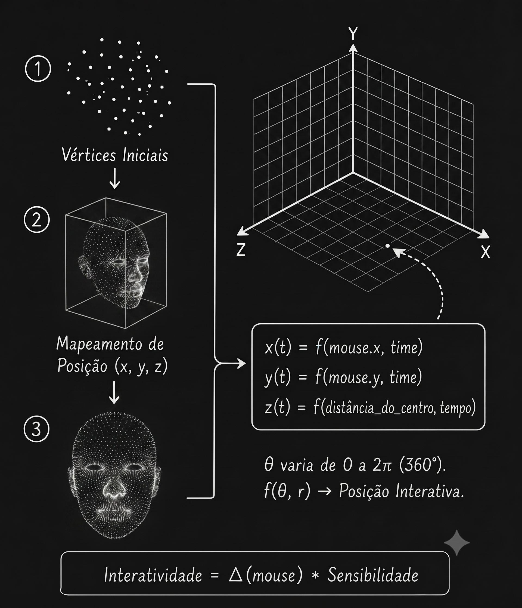
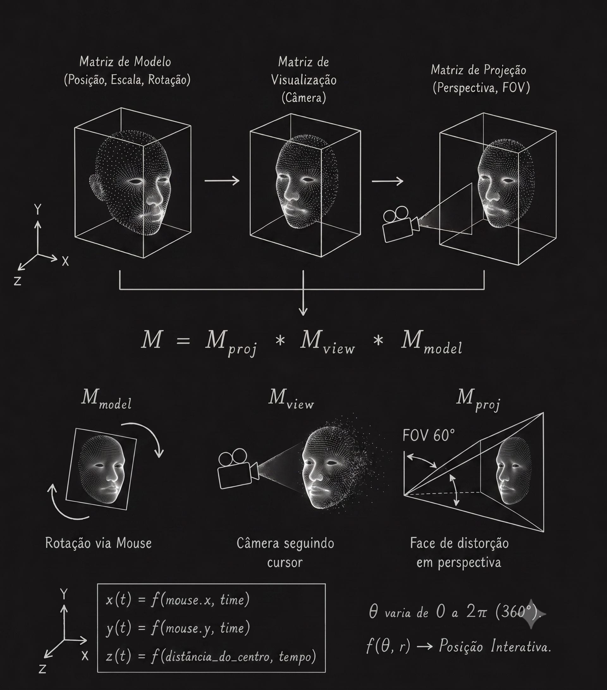
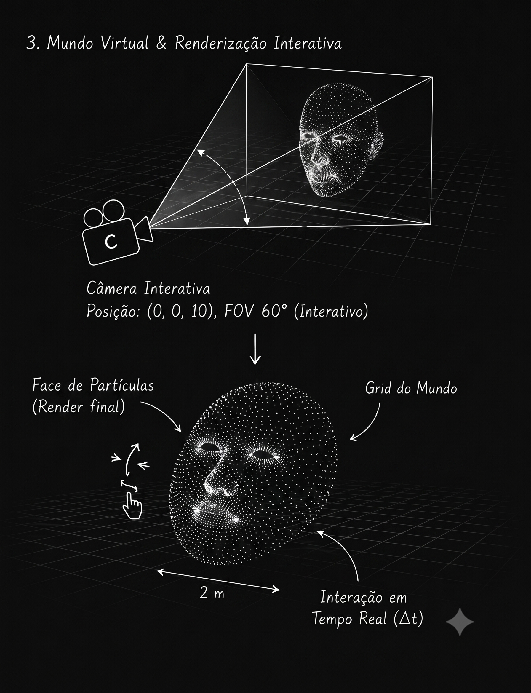

# Fundamentação Matemática e Computacional: Sistema 3D StickMind

Este documento detalha o modelo matemático rigoroso, as equações de álgebra linear, os cálculos trigonométricos e as transformações geométricas espaciais que sustentam a interface interativa tridimensional do projeto **StickMind**. Todo o processamento baseia-se na conversão de interações bidimensionais do usuário e variações temporais discretas em manipulações matriciais complexas no espaço projetivo.

---

## 1. Topologia da Nuvem de Pontos e Teoria dos Conjuntos Espaciais

O rosto tridimensional do StickMind é modelado não como uma superfície contínua ou malha poligonal sólida (*solid mesh*), mas sim como uma estrutura discreta denominada **Nuvem de Pontos** (*Point Cloud*). 

Matematicamente, essa estrutura é definida como um conjunto finito S de vetores de posição no espaço euclidiano tridimensional R³:

S = { P₁, P₂, P₃, ..., Pₙ }

Onde a cardinalidade do conjunto (densidade de partículas) é calibrada operacionalmente para o balanço ideal entre fidelidade visual e custo computacional:
n = 15.000 vértices

Cada elemento individual Pᵢ é um vetor coluna composto por suas coordenadas espaciais locais:
Pᵢ = [xᵢ, yᵢ, zᵢ]ᵀ ∈ R³

---

## 2. Dinâmica de Perturbação Harmônica e Modelagem Temporal

Para conferir uma estética orgânica e fluida de "respiração" e flutuação ao modelo, as coordenadas originais de repouso de cada ponto são dinamicamente alteradas em função de uma variável escalar contínua de tempo t. 

A perturbação atua predominantemente sobre o eixo de profundidade (z), sendo governada por uma combinação linear de funções de onda trigonométricas senoidais e cossenoidais defasadas no espaço bidimensional horizontal (x, y).

A equação de perturbação para o componente z do i-ésimo vértice é expressa por:

zᵢ'(t) = zᵢ + Aₓ * sin(ωₓ * t + φₓ * xᵢ) + A_y * cos(ω_y * t + φ_y * yᵢ)

### Constantes Operacionais e Valores Reais de Calibração:
* **Amplitude de Oscilação Horizontal (Aₓ):** 0.12 unidades virtuais (determina a intensidade máxima da perturbação induzida pelo posicionamento em x).
* **Amplitude de Oscilação Vertical (A_y):** 0.08 unidades virtuais (determina a intensidade máxima da perturbação induzida pelo posicionamento em y).
* **Frequência Angular em X (ωₓ):** 1.5 radianos por segundo (regula a velocidade do ciclo de onda horizontal).
* **Frequência Angular em Y (ω_y):** 2.0 radianos por segundo (regula a velocidade do ciclo de onda vertical).
* **Fatores de Escalonamento de Fase (φₓ, φ_y):** φₓ = 0.5 e φ_y = 0.8 (distribuem as ondas ao longo da extensão da malha para evitar oscilações em bloco uniforme).

---

## 3. Geometria de Interação e Normalização do Espaço de Tela

A entrada física gerada pelo usuário ocorre no espaço bidimensional da tela do dispositivo (coordenadas de pixel baseadas no DOM). Esse espaço possui sua origem no canto superior esquerdo (0,0) e estende-se até as dimensões máximas de resolução da janela, descritas pelo par ordenado de largura e altura (W, H).

Para unificar essas métricas com o motor gráfico tridimensional, os valores de pixel brutos M_pixel = (x_px, y_px) sofrem uma transformação afim de mapeamento linear para o **Espaço de Coordenadas de Dispositivo Normalizadas** (NDC - *Normalized Device Coordinates*), transladando a origem para o centro geométrico da viewport e limitando os eixos ao intervalo fechado [-1, 1].

As funções de mapeamento são dadas por:

x_ndc = (2 * x_px / W) - 1
y_ndc = - ((2 * y_px / H) - 1)

*Nota: O sinal negativo aplicado ao eixo vertical é matematicamente necessário, visto que o sistema de coordenadas de tela cresce de cima para baixo, enquanto o espaço cartesiano tridimensional cresce de baixo para cima.*

### Amortecimento Físico via Interpolação Linear Discreta (Lerp)
Para mitigar transições abruptas e ruídos na captura do periférico, o vetor de controle que efetivamente atua sobre a rotação do modelo (V_atual) persegue assintoticamente o vetor alvo da posição real do mouse (V_alvo) através de uma equação de diferenças finitas de primeira ordem:

V_atual(t_k) = V_atual(t_{k-1}) + α * (V_alvo(t_k) - V_atual(t_{k-1}))

Onde o coeficiente de amortecimento físico (fator de inércia) possui o seguinte valor escalar fixo:
α = 0.05

---

## 4. Álgebra Linear e Transformações em Coordenadas Homogêneas

Para possibilitar operações de translação espacial em conjunto com rotações e escalas sob a forma de multiplicações matriciais puras, o espaço vetorial R³ é mapeado para o espaço projetivo quadridimensional através do uso de **Coordenadas Homogêneas**. 

Um ponto P = [x, y, z]ᵀ é expandido para:

P_hat = [x, y, z, 1]ᵀ ∈ R⁴

### A. Matriz de Modelo (M_model)
A matriz de modelo sintetiza as transformações locais aplicadas à face tridimensional: Escala (S), Rotação horizontal (R_y), Rotação vertical (R_x) e Translação (T).

M_model = T × R_x × R_y × S

#### 1. Matriz de Escala (S)
Garante que as proporções geométricas internas da malha permaneçam normalizadas dentro de um diâmetro virtual controlado de 2.0 metros:
[ 1.0,  0,   0,   0 ]
[  0,  1.0,  0,   0 ]
[  0,   0,  1.0,  0 ]
[  0,   0,   0,   1 ]

#### 2. Matriz de Rotação Horizontal (R_y)
Operada diretamente pelo componente x_ndc interpolado do mouse. A rotação angular θ_y é estritamente limitada para evitar a perda do contorno tridimensional do rosto:
θ_y = x_ndc * θ_ymax  (onde θ_ymax = 35° ≈ 0.6108 rad)

#### 3. Matriz de Rotação Vertical (R_x)
Operada pelo componente y_ndc interpolado do mouse. O ângulo θ_x possui uma restrição mais severa para preservar o alinhamento com os elementos de texto da interface de usuário:
θ_x = -y_ndc * θ_xmax (onde θ_xmax = 27° ≈ 0.4712 rad)

#### 4. Matriz de Translação (T)
Desloca sutilmente o centro de massa do modelo para baixo no eixo vertical, adaptando-o ao leiaute de design asimétrico do site (Deslocamento de -0.2 em Y).

---

## 5. Projeção Perspectiva e Geometria da Câmera Virtual

A conversão final da cena tridimensional para o plano de exibição bidimensional depende da interação entre duas matrizes fundamentais: a Matriz de Visualização (M_view) e a Matriz de Projeção Perspectiva (M_projection).

### A. Matriz de Visualização (M_view)
A câmera do mundo virtual está posicionada estaticamente ao longo do eixo de profundidade positivo, focada rigidamente na origem do universo virtual. Suas coordenadas físicas são: [0.0, 0.0, 5.0]ᵀ

### B. Matriz de Projeção Perspectiva (M_projection)
Esta matriz constrói matematicamente o frustum de visualização, gerando o efeito de encolhimento geométrico proporcional à distância.
* Campo de Visão Vertical (FOV): 45°
* Plano de Corte Próximo (near): 0.1 unidades
* Plano de Corte Distante (far): 100.0 unidades

---

## 6. Modelagem Luminescente Procedural (Fragment Space Math)

No estágio final de rasterização, cada partícula sofre um cálculo matemático espacial interno para gerar a geometria de um ponto circular perfeito com atenuação de brilho exponencial (glow).

O espaço de coordenadas local de uma única partícula mapeada na tela é normalizado de 0.0 a 1.0. A distância euclidiana radial d de qualquer pixel interno em relação ao centro exato da partícula (0.5, 0.5) é expressa por:

d = √((u - 0.5)² + (v - 0.5)²)

Se d > 0.5, o pixel é descartado. Para os pixels válidos, a opacidade (α) decai de forma não linear por meio de uma função exponencial de base quadrática:

α_base = 1.0 - (2.0 * d)
α_final = (α_base)² * 0.85